<div align="center">

```
 ▗▄▄▖▗▄▄▄▖▗▖  ▗▖  ▗▖▗▄▄▄▖▗▄▄▄▖▗▄▄▖ ▗▄▄▄▖▗▖  ▗▖▗▖ ▗▖ ▗▄▖ 
▐▌     █  ▐▌  ▐▌  ▐▌▐▌     █  ▐▌ ▐▌  █  ▐▛▚▖▐▌▐▌ ▐▌▐▌ ▐▌
 ▝▀▚▖  █  ▐▌  ▐▌  ▐▌▐▛▀▀▘  █  ▐▛▀▚▖  █  ▐▌ ▝▜▌▐▛▀▜▌▐▛▀▜▌
▗▄▄▞▘▗▄█▄▖▐▙▄▄▖▝▚▞▘ ▐▙▄▄▖▗▄█▄▖▐▌ ▐▌▗▄█▄▖▐▌  ▐▌▐▌ ▐▌▐▌ ▐▌
                                     
                            github.com / silveirinhajuan
```

<br>

<p>
  
  
  
</p>

<p>
  Building reliable backend systems and exploring quantum computing, AI, and data engineering.
</p>

<br><br>

<h3>GitHub at a glance</h3>

<a href="https://github.com/silveirinhajuan">
  
</a>
<a href="https://github.com/silveirinhajuan">
  
</a>

<br><br>

<h3><code>silveirinhajuan@github ~ $ ./contributions.sh</code></h3>


<br><br>

<h3><code>silveirinhajuan@github ~ $ whoami --ascii</code></h3>

<table>
  <tr>
    <td valign="top"></td>
    <td valign="top"></td>
  </tr>
</table>

<br>

---

<br>

## Core stack

<br>

**🐍 Languages & Frameworks**


**🧠 AI / ML / Data Science**


**🌐 Web & Frontend**


**🛠️ Productivity & Testing**


<br>

---

<br>

## Connect

<p align="center">
  <a href="https://instagram.com/juanfocado">
    
  </a>
  &nbsp;
  <a href="https://linkedin.com/in/silveirinhajuan">
    
  </a>
  &nbsp;
  <a href="mailto:silveirinhajuan@proton.me">
    
  </a>
</p>

<br>

---

<br>

```
[INIT] session=silveirinhajuan@github status=ONLINE
[ OK ] All systems nominal
[EXIT] Connection stable. ↓ Building the future ↓
```

<br>

<sub>⚡ Built with custom SVGs, GitHub Stats Cards, and Shields.io static badges.</sub>

</div>
